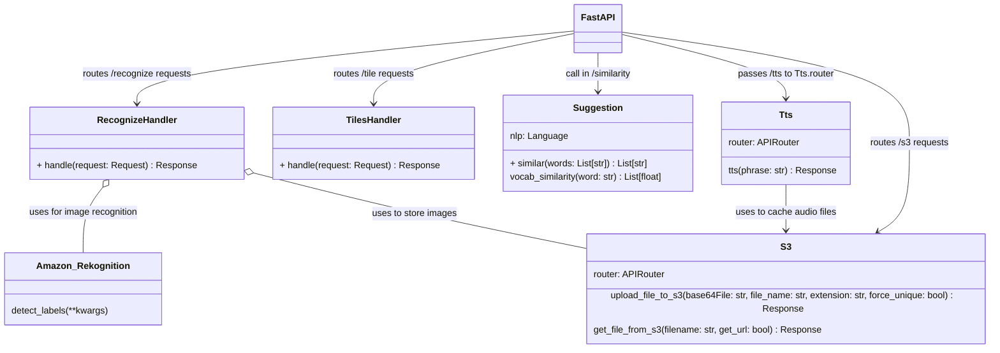

# Backend

### UML

```mermaid
classDiagram
  class FastAPI {
    
  }

  class RecognizeHandler {
    + handle(request: Request) Response
  }

  class TilesHandler {
    + handle(request: Request) Response
  }


  class Amazon_Rekognition {
    detect_labels(**kwargs)
  }

  class Suggestion {
    nlp: Language
    + similar(words: List[str]) List[str]
    vocab_similarity(word: str) List[float]
  }

  class Tts {
    router: APIRouter
    tts(phrase: str) Response
  }

  class S3 {
    router: APIRouter
    upload_file_to_s3(base64File: str, file_name: str, extension: str, force_unique: bool) Response
    get_file_from_s3(filename: str, get_url: bool) Response
  }

  FastAPI --> RecognizeHandler: routes /recognize requests
  FastAPI --> TilesHandler: routes /tile requests
  FastAPI --> Suggestion: call in /similarity
  FastAPI --> Tts: passes /tts to Tts.router
  FastAPI --> S3: routes /s3 requests

  Tts --> S3: uses to cache audio files

  RecognizeHandler o-- Amazon_Rekognition: uses for image recognition 
  RecognizeHandler o-- S3: uses to store images
```

In this Diagram, the FASTAPI application will send routes to python submodules. Some submodules make use of AWS services like Rekognition or S3 (Object Storage).