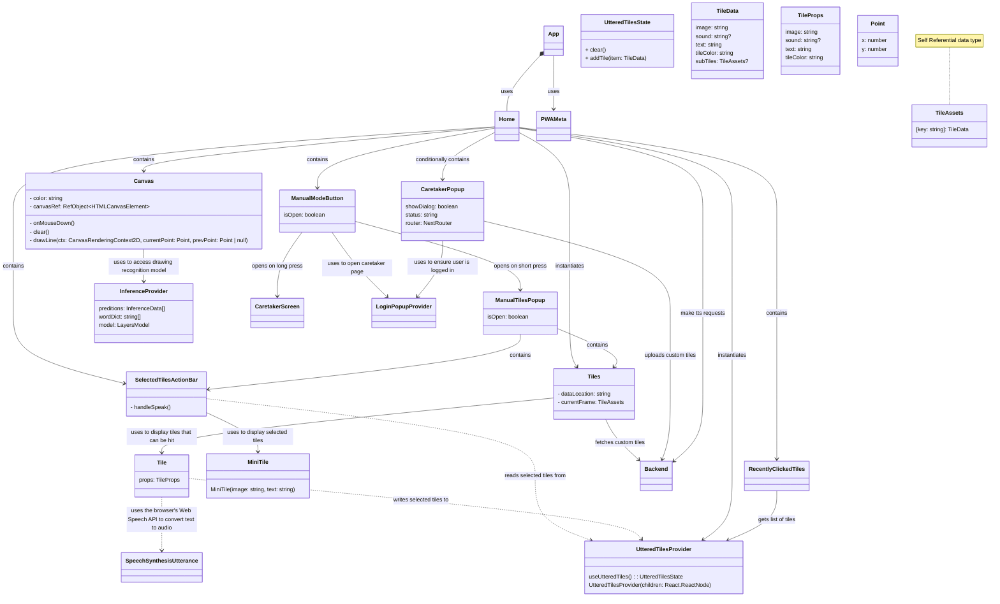
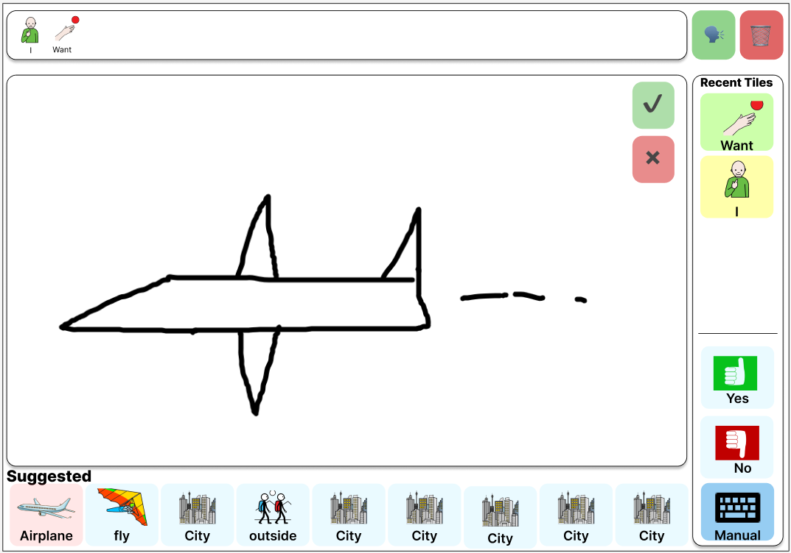

# Frontend

### UML

> Classes with no relationships are used as datatypes.

Our frontend is a Next.js app built using React features. Many classes in the above diagram inherit from React.JSX.Element, including App, Home, SelectedTilesActionBar, Tiles, Canvas, and PWAMeta. App is a Next.js internal class as the entry point into our application and page router, but we add headers through PWAMeta to enable PWA features for our app.

### Visual Diagram

User can draw on the main canvas which will show tile suggestions at the bottom. As the user continues to draw, suggestions are updated and presented in the bottom row of tiles. When a user clicks on a tile, it is saved to the recent tiles, which are presented above the persistent 'Yes' and 'No' tiles (which are difficult to draw). When the user is ready to speak their sentence, they may press the check mark button at the top right of the screen. If the user is unhappy with their sentence, or they do not need to speak it anymore, they may press the trashcan icon to clear the action bar. The manual tile in the bottom right is used to enter the 'Manual Mode' which is the standard tile system used in current AAC solutions.
