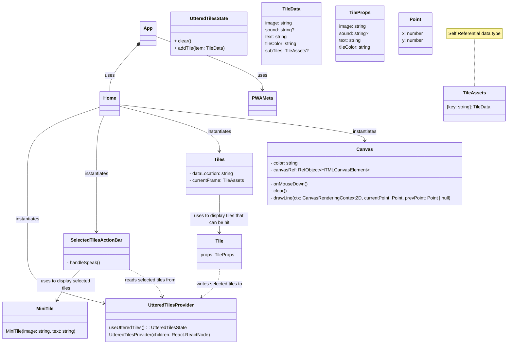

# Frontend UML

Our frontend is a Next.js app built using React features. Many classes in the above diagram inherit from React.JSX.Element, including App, Home, SelectedTilesActionBar, Tiles, Canvas, and PWAMeta. App is a Next.js internal class as the entry point into our application and page router, but we add headers through PWAMeta to enable PWA features for our app.
