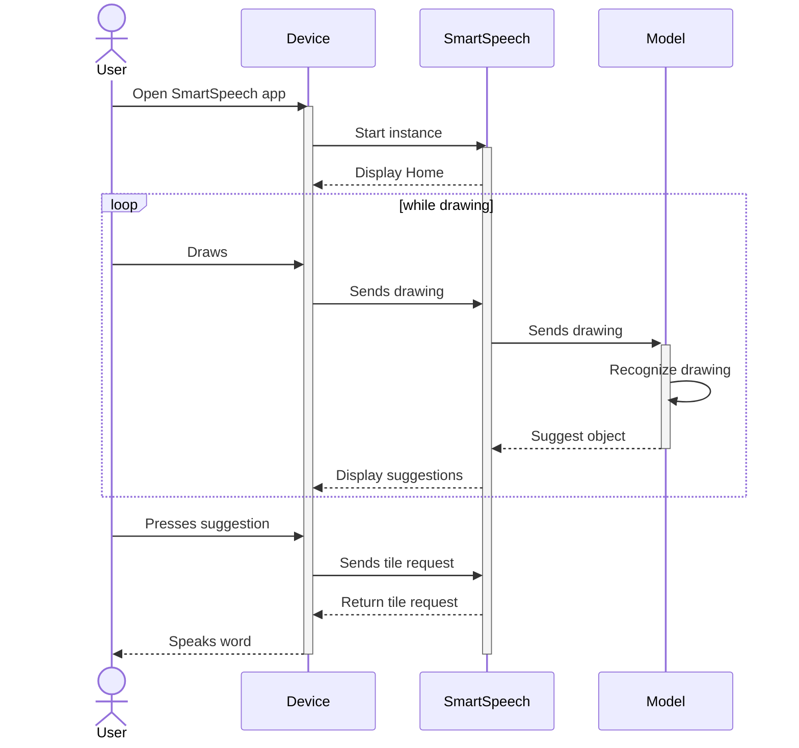
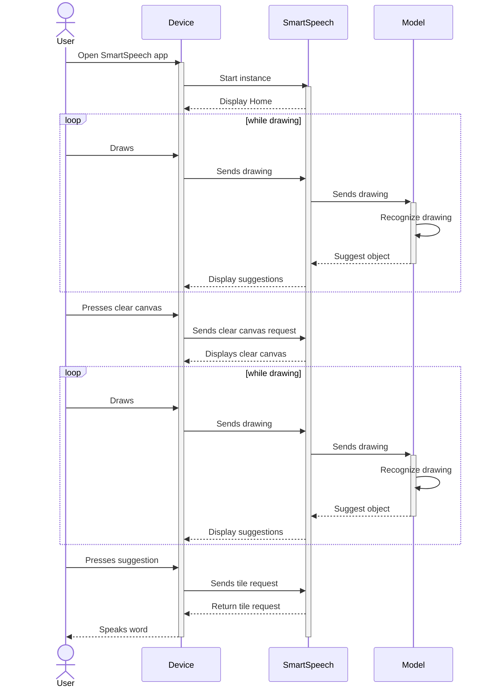
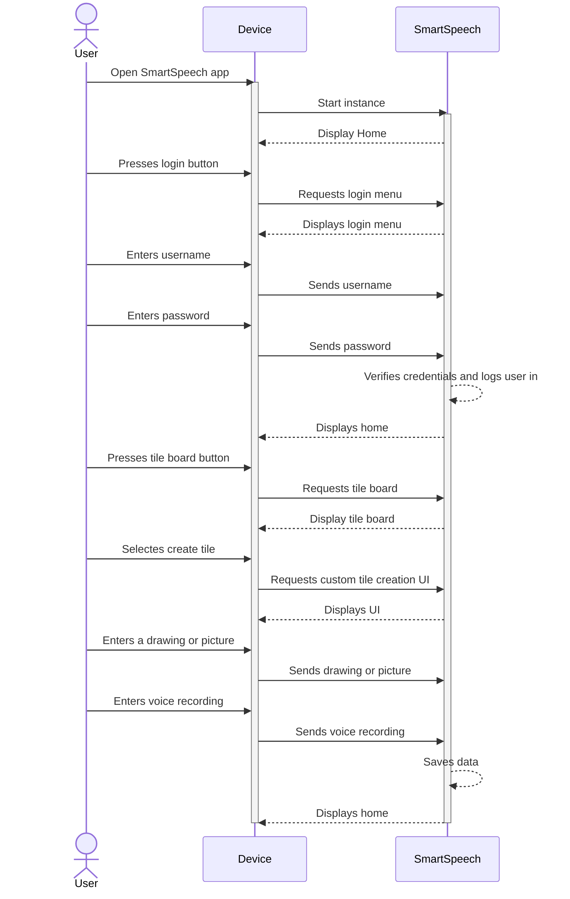
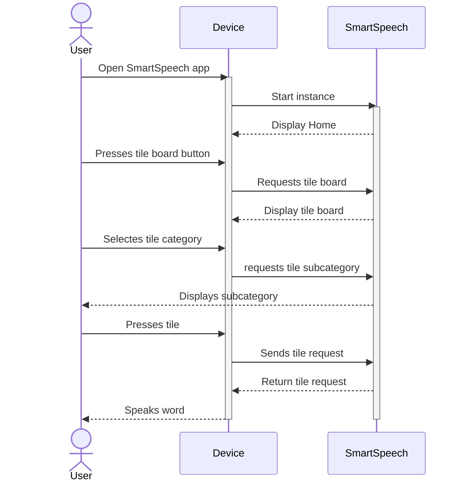
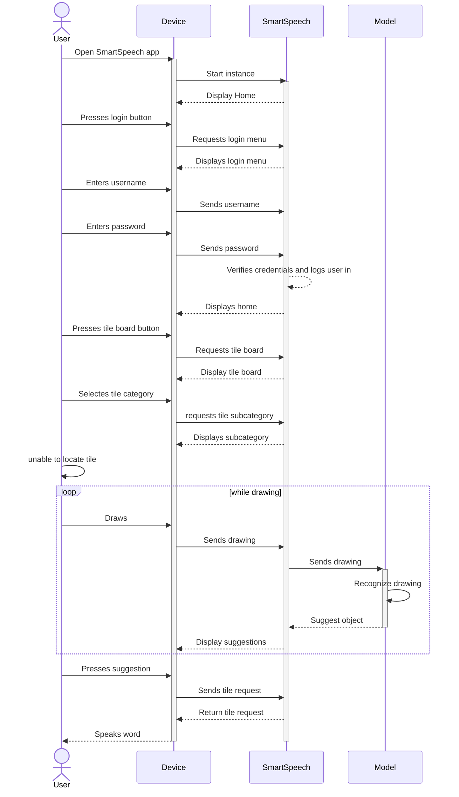
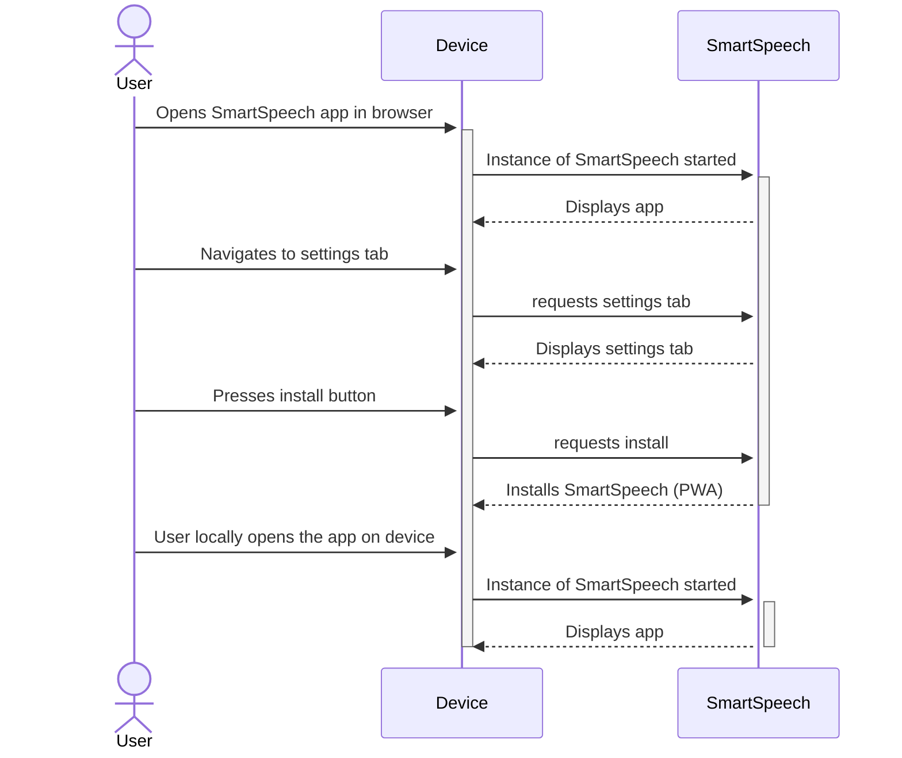
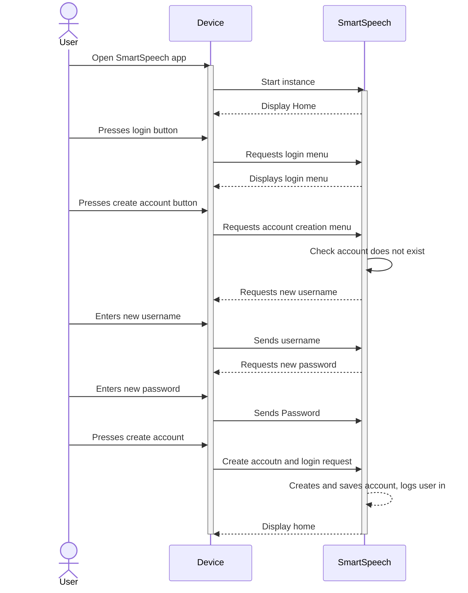
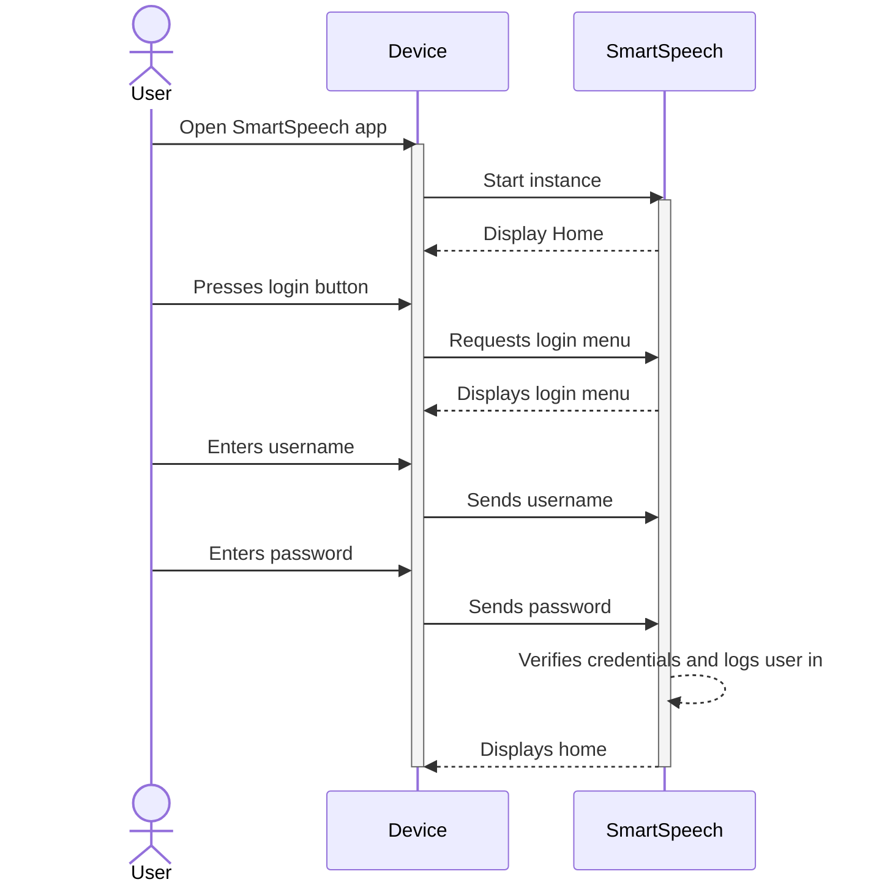
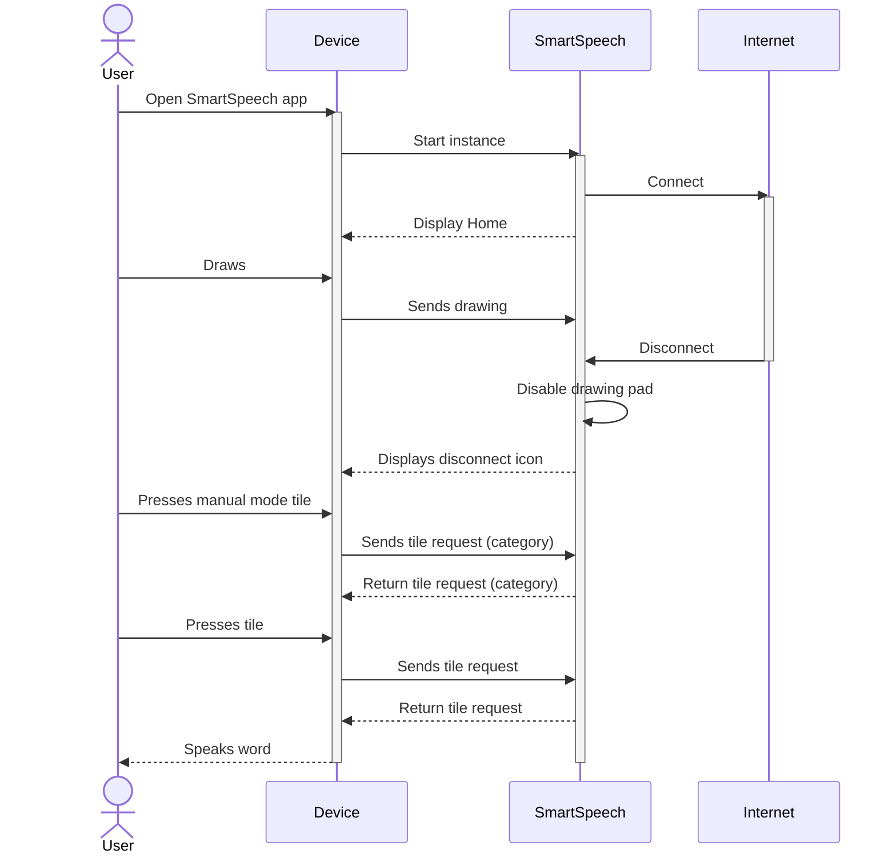

# Sequence Diagrams

## Use Case 1: *Drawing Recognition* - Drawing is Recognized
**User wants to draw a picture to help them communicate, and it is recognized in the top options.**


```
This sequence diagram details the process of a user drawing what they want to speak and then SmartSpeech recognizing and speaking the word through the device. This is the main functionality of SmartSpeech.

1. User opens the app on their device
2. User draws a picture of what they want to say on the drawing pad
3. User is prompted with a list of suggestions describing their drawing
5. Drawing is correctly recognized, so User taps the corresponding tile on the screen
6. Word is spoken using the speaker on the device
```


## Use Case 2: *Image Drawing* - Edit Drawing
**User wants to draw a picture to help them communicate, but then changes their drawing after they come up with a different way to draw it.**


```
This sequence diagram details the process of clearing the drawing pad when the word the user wants to speak is either not recognized or they want to portray it in a different way. This showcases the clear drawing pad function.

1. User opens the app on their device
2. User begins to draw a picture of what they want to say on the drawing pad
3. User clicks the clear canvas button to redraw the picture
4. User redraws the picture
5. User is prompted with a list of suggestions describing their drawing
6. Drawing is correctly recognized, so User taps the corresponding tile on the screen
7. Word is spoken using the speaker on the device
```


## Use Case 3: *AAC Board* - Add Custom Tiles
**User wants to add custom tile to their tile board.**


```
This sequence diagram details the process of adding a custom tile to a user's SmartSpeech account. Custom tiles are helpful in increasing the efficacy of AAC solutions.

1. User opens the app on their device
2. User logs in to their account
3. User presses the tile board button on the main screen
4. User presses the create custom tile button
5. User enters a drawing or picture to be displayed on the tile
6. User enters a voice recording to go with the tile
7. User presses the save button to save their new custom tile
```
 

## Use Case 4: *AAC Board* - Use Tile Board
**User knows where to locate their word on the tile board, so they switch to that page.**


```
This sequence diagram details the process of a user searching through the tile board in order to find the word they want to speak. This function is designed as a back up to the drawing pad.

1. User presses the tile board button on the main screen
2. User taps the category their word belongs to 
3. User taps the tile corresponding to their word on the screen
4. Word is spoken using the speaker on the device
```


## Use Case 5: *Image Recognition & Drawing* - Draw Rather Than Using Tiles
**User does not know where to locate their word on the tile board, so they draw it instead.**


```
This sequence diagram details and highlights the intuitive function of a user drawing what they want to speak on SmartSpeech instead of finding the word in the tile menues. This highlights the defining function of SmartSpeech compared to current AAC solutions that require the use of tile menues.

1. User presses tile board button on the main screen
2. User taps the category they think their word belongs to 
3. User is unable to find the word tile they want to use, so they return to the main screen
4. User draws a picture of what they want to say on the drawing pad
5. User is prompted with a list of suggestions describing their drawing
6. Drawing is correctly recognized, so User taps the corresponding tile on the screen
7. Word is spoken using the speaker on the device
```


## Use Case 6: Download App
**User wants to download the app**


```
This sequence diagram details how a user would download SmartSpeech to their device to have it more available when there is either poor or unavailable internet connection.

1. User opens the website on their device
2. User navigates to the settings of the app
3. User chooses the install option
4. The app is installed on the device, and the user opens the app locally by clicking the app icon
```


## Use Case 7: Account Creation
**User wants to create an account to begin creating tiles**


```
This sequence diagram details how a user would create an account.

1. User opens the app
2. User selects the login button
3. User selects the "create account" button
4. User enters their new username and password
5. User selects create account
6. User's account is created, and they are logged into their new account where they can create their own tiles and save configurations
```


## Use Case 8: *AAC Board* - View Custom Tiles
**User wants to login to view tiles**


```
This sequence diagram displays how a user will log in to SmartSpeech to access additional functionalities like custom tiles.

1. User opens the app
2. User selects the login button
3. User enters their password and their username
4. User selects login
5. User is logged into their account where they can create their own tiles and save configurations
```


## Use Case 9: *PWA* - Connection Lost
**User loses Wi-Fi connection during use of the app**


```
This sequence diagram displays how SmartSpeech will adapt to the loss of its drawing recognition model accessed through internet connection.

1. User opens the app
2. User begins to draw what they want to say but lose connection to the internet
3. User is notified of the disconnection by an icon, and the drawing board disconnects
4. User navigates the manual tile board 
5. User taps the category their word belongs to 
6. User taps the tile corresponding to their word on the screen
7. Word is spoken using the speaker on the device
```